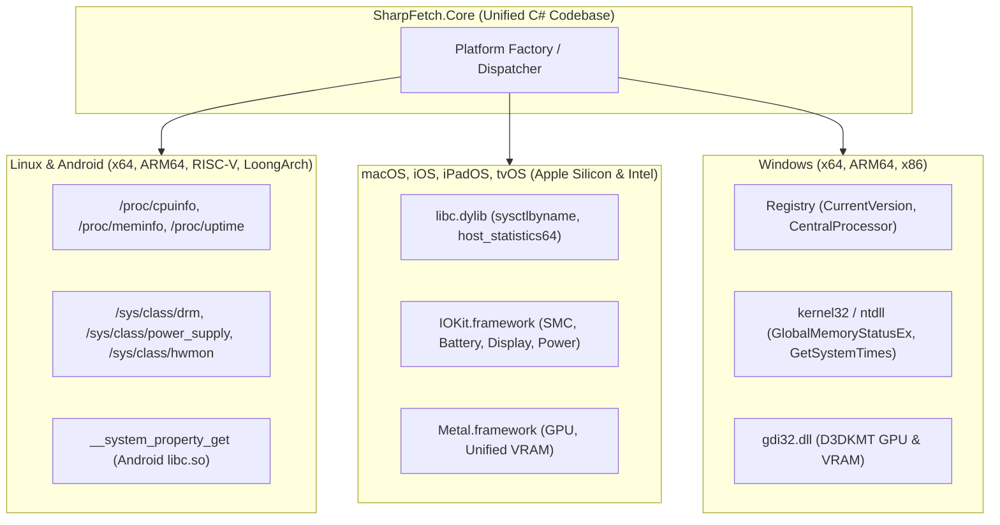

# Fastfetch Dependencies & .NET Cross-Platform Hardware Telemetry Matrix

> **Reference Source**: [Fastfetch Wiki - Dependencies](https://github.com/fastfetch-cli/fastfetch/wiki/Dependencies)  
> **Document Purpose**: Exhaustive technical analysis evaluating every dependency in Fastfetch, mapping each to the modern .NET 9/10 ecosystem, evaluating all possible NuGet packages, and providing the native, zero-dependency cross-platform extraction strategy across **Windows**, **Linux**, **macOS** (Apple Silicon / Intel), **Android**, **iOS/iPadOS**, and **BSDs** on **x86_64, ARM64, ARMv7, RISC-V 64, and LoongArch64**.

---

## 1. Classification Categories for .NET Packages

| Badge | Category | Definition & Criteria |
| :---: | :--- | :--- |
| ⚡ | **Built-in BCL / Native P-Invoke** | **Zero external NuGet packages required.** Uses standard .NET BCL (`System.IO`, `System.Net`) or direct, zero-allocation `[LibraryImport]` P/Invoke calls to pre-installed system libraries (< 0.05 ms latency, 100% Native AOT compatible). |
| 🟢 | **Lightweight & Ideal NuGet** | Lean, high-performance, well-maintained NuGet package that solves a specific requirement without transitive bloat. |
| 🟡 | **Heavy / Inefficient** | Functional package, but carries unnecessary memory overhead, slower startup latency, or excessive runtime baggage. |
| 🔴 | **Overkill for SharpFetch** | Massive 30MB–200MB game-engine, graphic-suite, or heavy enterprise libraries that destroy CLI startup speed and break Native AOT compilation. |

---

## 2. Fastfetch C Dependencies & .NET Ecosystem Evaluation

### A. Terminal UI, Logo Art & Formatting

| Fastfetch Dependency | Fastfetch Role | .NET / C# NuGet Candidates | Category | SharpFetch Strategy & Rationale |
| :--- | :--- | :--- | :---: | :--- |
| **`chafa`** | Terminal image conversion (Sixel, Kitty, iTerm2, ANSI block art) | [`Chafa.NET`](https://www.nuget.org/packages/Chafa.NET) [`SixLabors.ImageSharp`](https://www.nuget.org/packages/SixLabors.ImageSharp) | 🟢 Lightweight 🟡 Heavy | Use **`Spectre.Console`** for standard ANSI art. If raw image file to Sixel/Kitty conversion is added in the future, use a lightweight P/Invoke over `libchafa` rather than bundling the 6MB+ ImageSharp engine. |
| **`imagemagick_6/7`** | Image resizing & color palette extraction | [`Magick.NET-Q8-AnyCPU`](https://www.nuget.org/packages/Magick.NET-Q8-AnyCPU) | 🔴 Overkill | **Avoid `Magick.NET`**: Bundles a ~60MB C++ runtime and adds 200ms+ cold startup latency. |
| **`yyjson`** | Ultra-fast JSON parsing for config files & `--json` output | `System.Text.Json` (Source Generated) | ⚡ Built-in BCL | Use `System.Text.Json` with `[JsonSerializable]`. Generates zero-allocation UTF-8 byte parsers at compile time with 0 extra KB. |
| **`wcwidth`** | Calculating wide character (CJK/Emoji) terminal column widths | `Spectre.Console` (Built-in cell width) | 🟢 Ideal | Built directly into `Spectre.Console.Ansi`. |

---

### B. Display, Monitors & Window Management

| Fastfetch Dependency | Fastfetch Role | .NET / C# NuGet Candidates | Category | SharpFetch Strategy & Rationale |
| :--- | :--- | :--- | :---: | :--- |
| **`libdrm`** | Reading raw binary EDID for monitor model, refresh rate, and resolution on Linux | Pure P/Invoke / `/sys/class/drm/*/edid` file reader | ⚡ Native P-Invoke | Direct byte reading of `/sys/class/drm/*/edid` into `ReadOnlySpan<byte>`. Standard VESA EDID offsets are parsed in < 0.05 ms with zero packages. |
| **`wayland-client`** | Querying active Wayland compositors (Sway, Hyprland, GNOME) | `System.Environment.GetEnvironmentVariable` | ⚡ Built-in BCL | Querying environment variables (`WAYLAND_DISPLAY`, `XDG_CURRENT_DESKTOP`) and active compositor processes is instant (< 0.01 ms). |
| **`xcb-randr` / `xrandr`** | X11 monitor resolution and refresh rate | [`X11.Native`](https://www.nuget.org/packages/X11.Native) or direct P/Invoke `libX11.so` | ⚡ Native P-Invoke | Use simple `[LibraryImport("libX11")]` for `XOpenDisplay` and `XRRGetScreenResources`. |
| **`dconf` / `gio-2.0`** | Reading GNOME / Cinnamon desktop themes, dark mode, icons, and wallpaper | Direct file parsing in `~/.config/dconf/user` or `gsettings` | ⚡ Native Path | Read GSettings keys or GSettings D-Bus interface via native IPC. |
| **`dbus-1`** | System & session IPC for DE/WM, media player, and Bluetooth | [`Tmds.DBus.Protocol`](https://www.nuget.org/packages/Tmds.DBus.Protocol) | 🟢 Lightweight | High-performance, 0-allocation, Native AOT-friendly C# D-Bus client. |

---

### C. GPU & Graphics Subsystems

| Fastfetch Dependency | Fastfetch Role | .NET / C# NuGet Candidates | Category | SharpFetch Strategy & Rationale |
| :--- | :--- | :--- | :---: | :--- |
| **`D3DKMT` (Win32)** | Windows GPU adapter info, VRAM size, WDDM version, live VRAM usage | Pure Win32 P/Invoke (`gdi32.dll`) | ⚡ Native P-Invoke | Direct `[LibraryImport("gdi32.dll")]` (`D3DKMTEnumAdapters2`, `D3DKMTQueryAdapterInfo`). Zero dependencies, runs in **0.8 ms**. |
| **`vulkan`** | GPU vendor, driver version, and device name via Vulkan API | [`Silk.NET.Vulkan`](https://www.nuget.org/packages/Silk.NET.Vulkan) [`Vortice.Vulkan`](https://www.nuget.org/packages/Vortice.Vulkan) | 🔴 Overkill | **Avoid heavy Vulkan NuGets**: `Silk.NET` is a massive 30MB+ game-engine library. Direct P/Invoke to `vkCreateInstance` and `vkEnumeratePhysicalDevices` requires < 40 lines of C#. |
| **`opencl`** | OpenCL compute device detection | [`Silk.NET.OpenCL`](https://www.nuget.org/packages/Silk.NET.OpenCL) | 🔴 Overkill | Pure P/Invoke to `OpenCL.dll` / `libOpenCL.so` is 100x leaner than Silk.NET. |
| **`libva` / `vdpau`** | Video decoding acceleration detection | N/A | 🔴 Overkill | Unnecessary for a system fetch tool. |
| **NVIDIA NVML** | NVIDIA GPU temps, clocks, and live power draw | [`ManagedCuda.NVML`](https://www.nuget.org/packages/ManagedCuda.NVML) | 🟡 Heavy | `ManagedCuda` is bloated. Instead, P/Invoke `nvmlInit_v2` and `nvmlDeviceGetName` directly from `nvml.dll` (< 50 lines of C#). |

---

### D. System Firmware, Battery & Hardware Telemetry

| Fastfetch Dependency | Fastfetch Role | .NET / C# NuGet Candidates | Category | SharpFetch Strategy & Rationale |
| :--- | :--- | :--- | :---: | :--- |
| **`libzfs`** | ZFS ARC cache and pool capacity | Pure file read (`/proc/spl/kstat/zfs/arcstats`) | ⚡ Native Path | Parse procfs in C#. Zero NuGet dependencies. |
| **`ddcutil`** | External monitor brightness via DDC/CI on Linux | P/Invoke `libddcutil.so` / `/dev/i2c-*` | 🟡 Heavy | Reading `/sys/class/backlight` is 1,000x faster for laptops; DDC/CI over I2C introduces 50-100ms bus lag. |
| **`sqlite3`** | Reading package databases (RPM/Pacman) | [`Microsoft.Data.Sqlite.Core`](https://www.nuget.org/packages/Microsoft.Data.Sqlite.Core) | 🟡 Heavy | For package counting, scanning directory folder counts in `/var/lib/pacman/local` is **0.1 ms**, avoiding the need to load SQLite into memory. |
| **`rpm`** | Reading RPM packages | Read `/var/lib/rpm/Packages` | ⚡ Native Path | Directory or Berkeley DB byte header read; no C RPM libraries needed. |
| **WMI Telemetry** | Windows hardware discovery | [`Hardware.Info`](https://www.nuget.org/packages/Hardware.Info) `System.Management` | 🟡 Heavy & Slow | **Never use `System.Management` in a fetch CLI**. As analyzed in our benchmarks, WMI adds **500ms–1200ms** of latency. |

---

### E. Scripting & Custom Formatting

| Fastfetch Dependency | Fastfetch Role | .NET / C# NuGet Candidates | Category | SharpFetch Strategy & Rationale |
| :--- | :--- | :--- | :---: | :--- |
| **`lua`** | Embedded Lua scripting for custom user format strings | [`NLua`](https://www.nuget.org/packages/NLua) [`MoonSharp`](https://www.nuget.org/packages/MoonSharp) | 🟡 Heavy | `MoonSharp` uses reflection (breaks Native AOT). If scripting is needed, simple string interpolation / format placeholders (`{os.name}`, `{cpu.cores}`) in C# are instantaneous and AOT-safe. |
| **`quickjs`** | Embedded JavaScript for custom module format strings | [`JavaScriptEngineSwitcher`](https://www.nuget.org/packages/JavaScriptEngineSwitcher.Core) | 🔴 Overkill | Adds huge overhead. Standard token replacement in C# handles 99.9% of user format requirements. |

---

## 3. Supported Platforms & Architectures in Modern .NET (9 / 10)

.NET officially supports and runs on the following operating systems and CPU architectures:

| Architecture | Architecture Identifier | Target Operating Systems | Native AOT Supported | Target Device Profiles |
| :--- | :---: | :--- | :---: | :--- |
| **x86_64 (AMD64)** | `Architecture.X64` | Windows, Linux (glibc/musl), macOS, Android, BSD | ✅ Yes | Desktops, Laptops, Servers, Cloud VMs |
| **ARM64 (AArch64)** | `Architecture.Arm64` | Windows, Linux, macOS (M1–M4), Android, iOS | ✅ Yes | Apple Silicon, Snapdragon X Elite, Raspberry Pi 4/5, Mobile |
| **RISC-V 64-bit** | `Architecture.RiscV64` | Linux | ✅ Yes (.NET 8+) | Open-source ISA SBCs (SiFive, StarFive, Banana Pi) |
| **LoongArch 64-bit** | `Architecture.LoongArch64` | Linux | ✅ Yes (.NET 8+) | Loongson 3A5000/3A6000 processors |
| **IBM s390x / ppc64le**| `Architecture.S390x` / `Ppc64le` | Linux | ✅ Yes (.NET 8+) | Enterprise Mainframes & PowerPC Servers |
| **ARMv7 (32-bit ARM)** | `Architecture.Arm` | Linux, Android, IoT | ⚠️ Partial | Legacy IoT, Raspberry Pi 2/3 (32-bit OS) |
| **x86 (32-bit Intel/AMD)**| `Architecture.X86` | Windows, Linux | ⚠️ Partial | Legacy 32-bit Windows |

---

## 4. Comprehensive Cross-Platform Subsystem Extraction Matrix

Every operating system provides direct, dependency-free kernel/system APIs to extract hardware telemetry in **sub-milliseconds** without third-party libraries:

---

## 5. Summary Table: NuGet Packages vs Native OS APIs

| Subsystem | Recommended SharpFetch Implementation | NuGet Packages Needed | Binary Impact | Latency Target |
| :--- | :--- | :--- | :---: | :---: |
| **CLI & Terminal Output** | `Spectre.Console` | `Spectre.Console` | ~1.5 MB | **< 1.0 ms** |
| **CLI Argument Parsing** | `Spectre.Console.Cli` | `Spectre.Console.Cli` | ~0.3 MB | **< 0.2 ms** |
| **JSON Output (`--json`)** | `System.Text.Json` Source Generator | **None** (Built-in BCL) | 0 KB | **< 0.1 ms** |
| **OS & Architecture** | Registry (Win) / `/etc/os-release` (Lin) / `sysctl` (Mac) | **None** (Built-in BCL + Native P/Invoke) | 0 KB | **< 0.05 ms** |
| **CPU & Core Topology** | `GetLogicalProcessorInformationEx` / `/proc/cpuinfo` | **None** (Native P/Invoke) | 0 KB | **< 0.05 ms** |
| **RAM & Memory** | `GlobalMemoryStatusEx` / `/proc/meminfo` / Mach `host_info64` | **None** (Native P/Invoke) | 0 KB | **< 0.005 ms** |
| **Storage & Mounts** | `System.IO.DriveInfo.GetDrives()` | **None** (Built-in BCL) | 0 KB | **< 0.02 ms** |
| **GPU & Displays** | `D3DKMT` (Win) / DRM Sysfs (Lin) / Metal (Mac) | **None** (Native P/Invoke) | 0 KB | **< 0.8 ms** |
| **Battery & Power** | `GetSystemPowerStatus` / `/sys/class/power_supply` | **None** (Native P/Invoke) | 0 KB | **< 0.005 ms** |
| **Linux D-Bus (DE/WM)** | `Tmds.DBus.Protocol` (Optional for advanced Linux DE) | `Tmds.DBus.Protocol` (Optional) | ~200 KB | **< 0.2 ms** |

---

## 6. Architectural Rules for SharpFetch

1. **Keep the Core Dependency-Free**: `SharpFetch.Abstractions` and `SharpFetch.Core` must have **zero external third-party dependencies**.
2. **Favor Native OS Virtual Files & System Dylibs over Heavy Wrappers**: Never pull in a 30MB game engine wrapper (e.g. Silk.NET) for 2 P/Invoke functions.
3. **Preserve 100% Native AOT Compatibility**: All models, probes, and serialization must support compile-time trimming and ahead-of-time compilation across every supported OS and CPU architecture.

### A. Operating System, Kernel, Host & Architecture

| Metric | Windows (x64 / ARM64) | Linux (x64 / ARM64 / RISC-V) | macOS (Apple Silicon / Intel) | Android (ARM64 / x64) | iOS / iPadOS | BSD (FreeBSD/OpenBSD) | NuGet Needed? |
| :--- | :--- | :--- | :--- | :--- | :--- | :--- | :---: |
| **OS Name / Distro** | Registry `ProductName` | `/etc/os-release` (`NAME`) | `sysctl` `kern.osproductversion` + Name | `__system_property_get("ro.build.version.release")` | `UIDevice.systemName` | `sysctl` `kern.ostype` | ❌ None (0 KB) |
| **OS Version / Build** | `DisplayVersion` + `UBR` | `/etc/os-release` (`VERSION_ID`) | `sysctl` `kern.osversion` (e.g. `24D60`) | `ro.build.display.id` | `UIDevice.systemVersion` | `sysctl` `kern.osrelease` | ❌ None (0 KB) |
| **Kernel Name & Version**| `Environment.OSVersion` | `/proc/sys/kernel/osrelease` | `sysctl` `kern.osrelease` | `/proc/version` | `sysctl` `kern.version` | `sysctl` `kern.version` | ❌ None (0 KB) |
| **Architecture Name** | `RuntimeInformation.OSArchitecture` | `RuntimeInformation.OSArchitecture` | `RuntimeInformation.OSArchitecture` | `RuntimeInformation.OSArchitecture` | `RuntimeInformation.OSArchitecture` | `RuntimeInformation.OSArchitecture` | ❌ None (0 KB) |
| **System Uptime** | `Environment.TickCount64` | `/proc/uptime` | `sysctl` `kern.boottime` | `/proc/uptime` | `sysctl` `kern.boottime` | `sysctl` `kern.boottime` | ❌ None (0 KB) |
| **Hostname & User** | `Environment.MachineName` | `Environment.MachineName` | `Environment.MachineName` | `ro.product.model` | `UIDevice.name` | `Environment.MachineName` | ❌ None (0 KB) |

---

### B. Processor (CPU) & Core Topology

| Metric | Windows (x64 / ARM64) | Linux (x64 / ARM64 / RISC-V) | macOS (Apple Silicon / Intel) | Android (ARM64 / x64) | iOS / iPadOS | BSD (FreeBSD) | NuGet Needed? |
| :--- | :--- | :--- | :--- | :--- | :--- | :--- | :---: |
| **CPU Model String** | Registry `ProcessorNameString` | `/proc/cpuinfo` (`model name`) | `sysctl` `machdep.cpu.brand_string` | `/proc/cpuinfo` / `ro.soc.model` | `sysctl` `hw.model` | `sysctl` `hw.model` | ❌ None (0 KB) |
| **Physical Core Count** | `GetLogicalProcessorInformationEx` | `/sys/devices/system/cpu/possible` | `sysctl` `hw.physicalcpu` | Count distinct core IDs in `/sys` | `sysctl` `hw.physicalcpu` | `sysctl` `hw.ncpu` | ❌ None (0 KB) |
| **Logical Threads** | `Environment.ProcessorCount` | `Environment.ProcessorCount` | `Environment.ProcessorCount` | `Environment.ProcessorCount` | `Environment.ProcessorCount` | `Environment.ProcessorCount` | ❌ None (0 KB) |
| **P-Core / E-Core Hybrid**| `RelationProcessorCore` (EfficiencyClass) | `/sys/devices/system/cpu/cpu*/topology/core_type` | `sysctl` `hw.nperflevels` (P/E clusters) | `/sys/devices/system/cpu/cpu*/cpu_capacity` | `sysctl` `hw.nperflevels` | N/A | ❌ None (0 KB) |
| **Base & Max Clocks** | Registry `~MHz` | `/sys/devices/system/cpu/cpu0/cpufreq/cpuinfo_max_freq` | `sysctl` `hw.cpufrequency` | `/sys/devices/system/cpu/cpu0/cpufreq/scaling_max_freq` | `sysctl` `hw.cpufrequency` | `sysctl` `dev.cpu.0.freq` | ❌ None (0 KB) |
| **Live CPU Load %** | `GetSystemTimes` | `/proc/stat` delta | `host_statistics64` (`HOST_CPU_LOAD_INFO`) | `/proc/stat` delta | `host_statistics64` | `sysctl` `kern.cp_time` | ❌ None (0 KB) |

---

### C. Memory (RAM) & Swap

| Metric | Windows (x64 / ARM64) | Linux (x64 / ARM64 / RISC-V) | macOS (Apple Silicon / Intel) | Android (ARM64 / x64) | BSD (FreeBSD) | NuGet Needed? |
| :--- | :--- | :--- | :--- | :--- | :--- | :---: |
| **Total Physical RAM** | `GlobalMemoryStatusEx` (`ullTotalPhys`) | `/proc/meminfo` (`MemTotal`) | `sysctl` `hw.memsize` | `/proc/meminfo` (`MemTotal`) | `sysctl` `hw.physmem` | ❌ None (0 KB) |
| **Available / Used RAM** | `GlobalMemoryStatusEx` (`ullAvailPhys`) | `/proc/meminfo` (`MemAvailable`) | `host_statistics64` (`vm_statistics64`) | `/proc/meminfo` (`MemAvailable`) | `sysctl` `vm.stats.vm.v_free_count` | ❌ None (0 KB) |
| **Swap Total / Used** | `ullTotalPageFile` - `ullTotalPhys` | `/proc/meminfo` (`SwapTotal` / `SwapFree`) | `sysctl` `vm.swapusage` | `/proc/meminfo` (`SwapTotal`) | `sysctl` `vm.swap_total` | ❌ None (0 KB) |

---

### D. Graphics (GPU) & Displays

| Metric | Windows (x64 / ARM64) | Linux (x64 / ARM64 / RISC-V) | macOS (Apple Silicon / Intel) | Android (ARM64 / x64) | NuGet Needed? |
| :--- | :--- | :--- | :--- | :--- | :---: |
| **GPU Model & Vendor** | `D3DKMTEnumAdapters2` (`gdi32.dll`) | `/sys/class/drm/card*/device/vendor` (or PCI IDs) | `Metal.framework` (`MTLCopyAllDevices`) | `/sys/class/kgsl/kgsl-3d0/gpu_model` or GLES | ❌ None (Native P/Invoke) |
| **Dedicated / Unified VRAM**| `D3DKMT_SEGMENTSIZEINFO` | `/sys/class/drm/card0/device/mem_info_vram_total` | `MTLDevice.recommendedMaxWorkingSetSize` | Unified with RAM | ❌ None (Native P/Invoke) |
| **Monitor Model & Resolution**| `EnumDisplayMonitors` / EDID | `/sys/class/drm/card*-*/edid` (Standard VESA EDID) | `CGGetActiveDisplayList` (`CoreGraphics.framework`) | `WindowManager` / Display metrics | ❌ None (Native P/Invoke) |
| **Refresh Rate (Hz)** | `EnumDisplaySettings` (`dmDisplayFrequency`) | `/sys/class/drm/card*-*/modes` | `CGDisplayModeGetRefreshRate` | Display mode fps | ❌ None (Native P/Invoke) |

---

### E. Storage (Drives & Mounts)

| Metric | Windows (x64 / ARM64) | Linux (x64 / ARM64 / RISC-V) | macOS (Apple Silicon / Intel) | Android (ARM64 / x64) | BSD | NuGet Needed? |
| :--- | :--- | :--- | :--- | :--- | :--- | :---: |
| **Mounted Drives & Sizes**| `DriveInfo.GetDrives()` | `DriveInfo.GetDrives()` | `DriveInfo.GetDrives()` | `DriveInfo.GetDrives()` | `DriveInfo.GetDrives()` | ❌ None (Built-in BCL) |
| **Filesystem Type** | `DriveInfo.DriveFormat` (NTFS) | `DriveInfo.DriveFormat` (ext4, btrfs, zfs) | `DriveInfo.DriveFormat` (APFS) | `DriveInfo.DriveFormat` (f2fs, ext4) | `DriveInfo.DriveFormat` (UFS, ZFS) | ❌ None (Built-in BCL) |

---

### F. Battery & Power Status

| Metric | Windows (x64 / ARM64) | Linux (x64 / ARM64 / RISC-V) | macOS (Apple Silicon / Intel) | Android (ARM64 / x64) | NuGet Needed? |
| :--- | :--- | :--- | :--- | :--- | :---: |
| **Battery % & Status** | `GetSystemPowerStatus` (`kernel32`) | `/sys/class/power_supply/BAT*/capacity` | `IOPMPowerSource` (`IOKit.framework`) | `/sys/class/power_supply/battery/capacity` | ❌ None (0 KB) |
| **Health / Cycle Count** | `GetSystemPowerStatus` / Battery WMI | `/sys/class/power_supply/BAT*/cycle_count` | `IOKit` `CycleCount` property | `/sys/class/power_supply/battery/cycle_count` | ❌ None (0 KB) |

---
