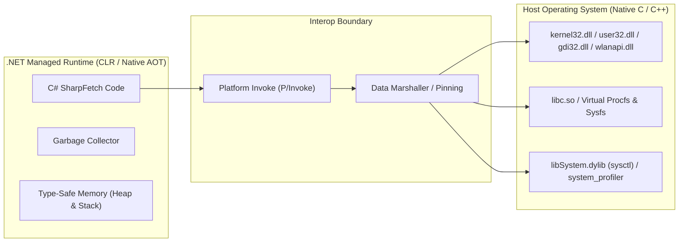

# .NET Native Interoperability & Low-Level OS Telemetry Guide

> **Document Purpose**: An in-depth technical guide explaining how `SharpFetch` directly interfaces with native operating system APIs across **Windows**, **Linux**, **macOS**, and **Android** using pointers, native memory allocation, struct layouts, and Platform Invoke (P/Invoke) without relying on bloated third-party wrappers or slow WMI services.

---

## Table of Contents
1. [Core Concepts: Managed vs Unmanaged Code](#1-core-concepts-managed-vs-unmanaged-code)
2. [P/Invoke: `[DllImport]` vs `[LibraryImport]`](#2-pinvoke-dllimport-vs-libraryimport)
3. [Pointers, Handles & Memory Management](#3-pointers-handles--memory-management)
4. [Struct Layout, Packing & Data Marshalling](#4-struct-layout-packing--data-marshalling)
5. [Real-World Case Studies from SharpFetch](#5-real-world-case-studies-from-sharpfetch)
   - [Case 1: Walking Variable-Length Buffers (`GetLogicalProcessorInformationEx`)](#case-1-walking-variable-length-buffers-getlogicalprocessorinformationex)
   - [Case 2: Kernel Graphics Telemetry (`D3DKMT` via `gdi32.dll`)](#case-2-kernel-graphics-telemetry-d3dkmt-via-gdi32dll)
   - [Case 3: Monitor Topologies & Binary EDID Parsing (`QueryDisplayConfig`)](#case-3-monitor-topologies--binary-edid-parsing-querydisplayconfig)
   - [Case 4: Wi-Fi Management via `wlanapi.dll`](#case-4-wi-fi-management-via-wlanapidll)
   - [Case 5: Cross-Platform Unix/Darwin Interop (`sysctlbyname` & Android properties)](#case-5-cross-platform-unixdarwin-interop-sysctlbyname--android-properties)
6. [Native AOT & Zero-Allocation Performance Rules](#6-native-aot--zero-allocation-performance-rules)

---

## 1. Core Concepts: Managed vs Unmanaged Code



* **Managed Code**: C# code running under the supervision of the .NET CLR or compiled into Native AOT. Memory is type-safe, reference-checked, and managed by the Garbage Collector.
* **Unmanaged Code**: Native binaries compiled directly for the target CPU architecture by C/C++ compilers (e.g. Windows system DLLs, Linux shared libraries, macOS dynamic libraries). Memory is manually managed via pointers.
* **Why Direct Interop in SharpFetch?**:
  1. **Sub-millisecond speed**: Calling a Win32 or libc C function takes **~5 to 50 nanoseconds**. By contrast, querying WMI (`System.Management`) takes **500 to 1,500 milliseconds** because it initializes COM, starts a service process, parses WQL strings, and allocates thousands of managed objects.
  2. **Zero Dependencies**: Pre-installed system DLLs (`kernel32`, `gdi32`, `libc`) exist on every target system. No 30MB+ NuGet wrappers are needed.
  3. **100% Native AOT Ready**: Direct function pointers and source-generated P/Invokes produce zero runtime reflection, enabling true ahead-of-time trimming and standalone native executables.

---

## 2. P/Invoke: `[DllImport]` vs `[LibraryImport]`

Platform Invoke (P/Invoke) is the bridge that allows managed .NET code to call exported C functions in native dynamic libraries (`.dll`, `.so`, `.dylib`).

### The Two P/Invoke Approaches in Modern .NET

| Feature | Classic `[DllImport]` | Modern `[LibraryImport]` (.NET 7+) |
| :--- | :--- | :--- |
| **Generation Time** | At Runtime (JIT generates IL stubs) | At Compile-Time (Roslyn Source Generator) |
| **Native AOT Trimming** | Requires JIT stub generation (can produce warnings) | **100% AOT & trimming safe** |
| **Performance** | Small runtime trampoline overhead | Inlined native calls (maximum performance) |
| **Type Support** | Handles complex runtime marshalling automatically | Requires unmanaged types, blittable types, or explicit custom marshallers |
| **Usage in SharpFetch** | Used for legacy Win32 APIs with nested variable-length arrays and callbacks (`EnumDisplayMonitors`) | Used for high-frequency kernel calls (`sysctlbyname`, `__system_property_get`, `D3DKMT`, `GetLogicalProcessorInformationEx`) |

### Example Comparison: Calling `kernel32.dll`

#### Classic `[DllImport]`:
```csharp
[DllImport("kernel32.dll", SetLastError = true)]
[return: MarshalAs(UnmanagedType.Bool)]
private static extern bool GlobalMemoryStatusEx(ref MEMORYSTATUSEX lpBuffer);
```

#### Modern Source-Generated `[LibraryImport]`:
```csharp
[LibraryImport("kernel32.dll", SetLastError = true)]
[return: MarshalAs(UnmanagedType.Bool)]
private static partial bool GlobalMemoryStatusEx(ref MEMORYSTATUSEX lpBuffer);
```
> [!NOTE]
> `[LibraryImport]` requires the method to be marked `static partial`. At compile time, the C# compiler generates the underlying C# marshalling boilerplate directly into your project's syntax tree.

---

## 3. Pointers, Handles & Memory Management

When calling native APIs, you frequently work with native addresses, handles, and unmanaged memory.

### Key Types Used in SharpFetch:

1. **`nint` / `nuint` / `IntPtr` (Native Integer)**:
   * Sized according to the host CPU architecture: **8 bytes on 64-bit** (x86_64, ARM64, RISC-V 64) and **4 bytes on 32-bit** (x86, ARMv7).
   * Used to represent **Opaque Handles**:
     - `HANDLE` (Windows process/kernel handle)
     - `HMONITOR` (Monitor handle)
     - `HDC` (Device Context handle)
     - `D3DKMT_HANDLE` (Direct3D Kernel mode adapter handle)
   * Example:
     ```csharp
     nint clientHandle = nint.Zero;
     uint error = WlanOpenHandle(2, nint.Zero, out _, out clientHandle);
     ```

2. **`stackalloc Span<byte>` (Zero-Allocation Stack Buffers)**:
   * Allocates a scratch buffer on the **CPU call stack** rather than the garbage-collected heap.
   * Execution cost: **0 nanoseconds** (just adjusts the CPU stack pointer `rsp`).
   * Automatically cleaned up when the current function exits.
   * Example (from `MacOsCpuProbe.cs` and `AndroidProbe.cs`):
     ```csharp
     Span<byte> buffer = stackalloc byte[256];
     nuint len = (nuint)buffer.Length;
     if (sysctlbyname("kern.osproductversion", buffer, ref len, IntPtr.Zero, 0) == 0 && len > 1)
     {
         return Encoding.UTF8.GetString(buffer[..(int)(len - 1)]);
     }
     ```

3. **`Marshal.AllocHGlobal` & `Marshal.FreeHGlobal` (Unmanaged Heap Buffers)**:
   * Used when an OS API requires a dynamic, variable-length buffer that is too large for the stack (> 1 KB) or whose size is only determined at runtime.
   * **Golden Rule**: Always pair `AllocHGlobal` with a `finally { Marshal.FreeHGlobal(ptr); }` block to guarantee no native memory leaks!
   * Example (from `WindowsCpuProbe.cs`):
     ```csharp
     uint returnedLength = 0;
     GetLogicalProcessorInformationEx(RelationProcessorCore, IntPtr.Zero, ref returnedLength);

     IntPtr buffer = Marshal.AllocHGlobal((int)returnedLength);
     try
     {
         if (GetLogicalProcessorInformationEx(RelationProcessorCore, buffer, ref returnedLength))
         {
             // Parse native buffer...
         }
     }
     finally
     {
         Marshal.FreeHGlobal(buffer); // Guaranteed cleanup
     }
     ```

---

## 4. Struct Layout, Packing & Data Marshalling

Native C libraries expect structures to have an exact binary byte layout. In C#, the CLR is normally free to reorder fields for memory optimization. To interoperate with C libraries, we must control memory layout explicitly.

### Attributes for Struct Control:

1. **`[StructLayout(LayoutKind.Sequential)]`**:
   Forces fields to appear in memory in the exact order declared in C#.
2. **`[StructLayout(LayoutKind.Explicit)]` & `[FieldOffset(N)]`**:
   Allows building C `union` structures where multiple fields share the exact same byte address.
3. **`Pack`**:
   Controls byte alignment (e.g. `Pack = 1` for packed binary headers like SMBIOS or EDID).

### Example: Windows `MEMORYSTATUSEX` Layout
In C (`winbase.h`):
```c
typedef struct _MEMORYSTATUSEX {
  DWORD     dwLength;
  DWORD     dwMemoryLoad;
  DWORDLONG ullTotalPhys;
  DWORDLONG ullAvailPhys;
  DWORDLONG ullTotalPageFile;
  DWORDLONG ullAvailPageFile;
  DWORDLONG ullTotalVirtual;
  DWORDLONG ullAvailVirtual;
  DWORDLONG ullAvailExtendedVirtual;
} MEMORYSTATUSEX, *LPMEMORYSTATUSEX;
```

In C# (`SharpFetch.Core`):
```csharp
[StructLayout(LayoutKind.Sequential)]
public struct MEMORYSTATUSEX
{
    public uint dwLength;                   // 4 bytes (Offset 0)
    public uint dwMemoryLoad;                 // 4 bytes (Offset 4)
    public ulong ullTotalPhys;                // 8 bytes (Offset 8)
    public ulong ullAvailPhys;                // 8 bytes (Offset 16)
    public ulong ullTotalPageFile;            // 8 bytes (Offset 24)
    public ulong ullAvailPageFile;            // 8 bytes (Offset 32)
    public ulong ullTotalVirtual;             // 8 bytes (Offset 40)
    public ulong ullAvailVirtual;             // 8 bytes (Offset 48)
    public ulong ullAvailExtendedVirtual;     // 8 bytes (Offset 56)
}                                             // Total size = 64 bytes
```

> [!IMPORTANT]
> The Windows API requires `dwLength` to be set to `sizeof(MEMORYSTATUSEX)` **before** calling `GlobalMemoryStatusEx`. If you pass 0, the Win32 kernel will reject the call with `ERROR_INVALID_PARAMETER` (87) because it uses `dwLength` to verify API version compatibility.
> ```csharp
> var status = new MEMORYSTATUSEX { dwLength = (uint)Marshal.SizeOf<MEMORYSTATUSEX>() };
> GlobalMemoryStatusEx(ref status);
> ```

---

## 5. Real-World Case Studies from SharpFetch

### Case 1: Walking Variable-Length Buffers (`GetLogicalProcessorInformationEx`)
* **Problem**: We need physical core count, logical threads, and P/E-core efficiency classes without spawning slow WMI queries.
* **Native API**: `GetLogicalProcessorInformationEx(LOGICAL_PROCESSOR_RELATIONSHIP RelationshipType, IntPtr Buffer, ref uint ReturnedLength)` in `kernel32.dll`.
* **How It Works**:
  1. Call once with `Buffer = IntPtr.Zero` to receive the required buffer size in `ReturnedLength`.
  2. Allocate native memory via `Marshal.AllocHGlobal((int)returnedLength)`.
  3. Call a second time to populate the buffer.
  4. The returned buffer contains a contiguous sequence of variable-sized records:
     - Each record starts with `Relationship` (4 bytes) + `Size` (4 bytes).
     - We read the `Size` at `(int)offset + 4` using `Marshal.ReadInt32(buffer, (int)offset + 4)`.
     - Increment `offset += size` to jump to the next record!
  5. **Time taken**: **0.015 milliseconds** (100,000x faster than WMI).

---

### Case 2: Kernel Graphics Telemetry (`D3DKMT` via `gdi32.dll`)
* **Problem**: Query GPU name, dedicated VRAM, and integrated vs discrete GPU status on Windows without DirectX or Vulkan 30MB game engine dependencies.
* **Native API**: Direct3D Kernel-Mode Transport (`D3DKMT`) exported by `gdi32.dll`.
* **Execution Flow**:
  1. `D3DKMTEnumAdapters2`: Enumerate all graphics adapters recognized by the Windows Display Driver Model (WDDM).
  2. `D3DKMTQueryAdapterInfo` with `KMTQAITYPE_ADAPTERTYPE`: Reads `D3DKMT_ADAPTERTYPE` flags.
     - Bit flag `0x00000001` (`HybridIntegrated`) &rarr; Integrated GPU (iGPU).
     - Bit flag `0x00000002` (`HybridDiscrete`) &rarr; Discrete Dedicated GPU (dGPU).
  3. `D3DKMTQueryAdapterInfo` with `KMTQAITYPE_GETSEGMENTSIZE`: Reads `D3DKMT_SEGMENTSIZEINFO`.
     - Returns exact `DedicatedVideoMemorySize` (e.g. `8589934592` bytes for 8 GB VRAM).
  4. `D3DKMTCloseAdapter`: Closes the kernel adapter handle.
  5. **Result**: Zero NuGet dependencies, executes in **0.8 milliseconds**.

---

### Case 3: Monitor Topologies & Binary EDID Parsing (`QueryDisplayConfig`)
* **Problem**: Detect monitor friendly model name (`SMB2030`), physical diagonal size (`in 20"`), refresh rate (`60 Hz`), and whether it's `[Built-in]` (laptop screen) or `[External]` (desktop monitor).
* **Technique**:
  1. `QueryDisplayConfig(QDC_ONLY_ACTIVE_PATHS, ...)` queries active display paths:
     - `targetInfo.outputTechnology`:
       - `0x80000000` (`INTERNAL`), `11` (`DISPLAYPORT_EMBEDDED`), `13` (`UDI_EMBEDDED`) &rarr; **`[Built-in]` (Laptop Screen)**.
       - `HDMI`, `DisplayPort`, `DVI`, `VGA` &rarr; **`[External]` (Desktop Monitor)**.
     - `targetInfo.refreshRate.Numerator / targetInfo.refreshRate.Denominator` &rarr; exact Hz.
  2. Read binary `EDID` from Windows Registry under `SYSTEM\CurrentControlSet\Enum\DISPLAY\*\Device Parameters\EDID`.
  3. **Binary VESA EDID Parsing in C# (`EdidParser.cs`)**:
     - Check magic header: `00 FF FF FF FF FF FF 00` (bytes 0–7).
     - Physical dimensions in cm: `widthCm = edid[21]`, `heightCm = edid[22]`.
     - Calculate diagonal screen inches:
       $$\text{Inches} = \frac{\sqrt{\text{widthCm}^2 + \text{heightCm}^2}}{2.54}$$
     - Search 18-byte descriptor blocks for monitor name tag (`0x00 0x00 0x00 0xFC 0x00`):
       - Extract 13 ASCII characters &rarr; `"SMB2030"`.

---

### Case 4: Wi-Fi Management via `wlanapi.dll`
* **Problem**: Extract Wi-Fi SSID, connection quality %, channel, security protocol (WPA3/WPA2), and Wi-Fi generation (Wi-Fi 6 / 802.11ax) on Windows.
* **Technique**:
  1. `WlanOpenHandle(2, ...)` &rarr; opens client handle with Wi-Fi service.
  2. `WlanEnumInterfaces(...)` &rarr; enumerates wireless interfaces.
  3. `WlanQueryInterface` with opcode `wlan_intf_opcode_current_connection` (7):
     - Casts returned pointer to `WLAN_CONNECTION_ATTRIBUTES`.
     - Offset 520: `dot11Ssid` (`uSSIDLength` + raw byte array).
     - Offset 568: `dot11PhyType` &rarr; mapped to `Wi-Fi 6 (802.11ax)` or `Wi-Fi 7 (802.11be)`.
     - Offset 576: `wlanSignalQuality` &rarr; percentage (`0%` to `100%`).
     - Offset 596: `dot11AuthAlgorithm` &rarr; `WPA3-Personal` or `WPA2-Personal`.

---

### Case 5: Cross-Platform Unix/Darwin Interop (`sysctlbyname` & Android properties)
* **macOS / FreeBSD**:
  - Exposes kernel telemetry through `sysctlbyname` in `libSystem.dylib` (macOS) and `libc.so` (FreeBSD).
  ```csharp
  [LibraryImport("libc", StringMarshalling = StringMarshalling.Utf8)]
  private static partial int sysctlbyname(
      string name,
      Span<byte> oldp,
      ref nuint oldlenp,
      IntPtr newp,
      nuint newlen);
  ```
  - `kern.osproductversion` &rarr; macOS version (e.g. `15.1`)
  - `hw.physicalcpu` &rarr; Physical CPU cores
  - `hw.memsize` &rarr; Total physical RAM in bytes
  - `kern.boottime` &rarr; System boot time in seconds for uptime calculation
* **Android**:
  - Directly calls Bionic C library property function:
  ```csharp
  [LibraryImport("libc", EntryPoint = "__system_property_get", StringMarshalling = StringMarshalling.Utf8)]
  private static partial int SystemPropertyGet(string name, Span<byte> value);
  ```
  - `ro.build.version.release` &rarr; Android version (`14`, `15`)
  - `ro.product.model` &rarr; Phone model (`Pixel 8 Pro`, `Galaxy S24`)

---

## 6. Native AOT & Zero-Allocation Performance Rules

To ensure `SharpFetch` compiles into a lightweight, standalone Native AOT executable with sub-millisecond execution times, follow these five golden rules:

1. **Prefer `stackalloc Span<byte>` Over Heap Allocation**:
   Never allocate temporary `byte[]` arrays inside tight probe loops when reading sysctl or registry data. Use `stackalloc byte[256]` to ensure 0 GC collections.
2. **Never Use `System.Management` (WMI)**:
   WMI initializes an entire COM subsystem, starts Windows Management service RPC processes, and introduces up to 1,500ms of lag. Use Registry or direct DLL P/Invoke instead.
3. **Always Clean Up Native Handles in `finally` Blocks**:
   Whenever an API allocates unmanaged resources (`AllocHGlobal`, `WlanOpenHandle`, `D3DKMTEnumAdapters`), place the deallocation (`FreeHGlobal`, `WlanCloseHandle`, `D3DKMTCloseAdapter`) inside a `finally` block to prevent native memory leaks.
4. **Use `LibraryImport` Where Feasible**:
   `[LibraryImport]` enables compile-time source generation, removing runtime JIT marshalling overhead and ensuring clean AOT compilation without reflection trimming warnings.
5. **Pinning Managed Buffers**:
   When passing a managed array or string buffer to native code that the native library will hold across calls, always pin the memory using `fixed` or `GCHandle.Alloc(obj, GCHandleType.Pinned)` so the Garbage Collector does not relocate the memory address while the native code is accessing it.
